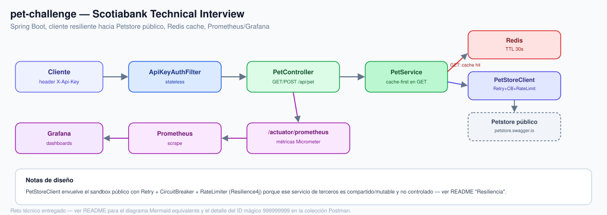

# pet-challenge — Scotiabank Ssr Backend Developer / Technical Interview

Proyecto Spring Boot que resuelve las actividades del desafío técnico
(consumo de la API pública de Petstore vía dos endpoints REST propios),
llevado más allá del alcance mínimo pedido: resiliencia, observabilidad,
tests en 4 capas, Docker y despliegue local en Kubernetes.

## Stack

| Componente        | Tecnología                                         |
|-------------------|-----------------------------------------------------|
| Lenguaje          | Java 17                                              |
| Framework         | Spring Boot 3.2.7 (Web, Validation, Actuator, Security) |
| Build             | Gradle (Groovy DSL)                                  |
| Resiliencia       | Resilience4j (retry + circuit breaker + rate limiter)|
| Cache             | Spring Cache + Redis (TTL 30s en `GET /api/pet/{idPet}`) |
| Métricas          | Micrometer + Prometheus (`/actuator/prometheus`)     |
| Seguridad         | API key por header (`X-Api-Key`) vía filtro propio   |
| Docs              | springdoc-openapi (Swagger UI)                       |
| Tests             | JUnit 5, Mockito, MockRestServiceServer, WireMock    |
| Contenedor        | Docker (multi-stage build) + Docker Compose (app+Redis) |
| Orquestación local| Kubernetes (Helm chart en `chart/`, pensado para `kind`/`minikube`) |
| API testing       | Colección Postman                                    |
| CI                | GitHub Actions (build+test, validación de manifiestos K8s) |

## Arquitectura



`PetService` es el único punto que decide cache-hit vs. llamada real: en `GET /api/pet/{idPet}` intenta Redis primero (TTL 30s) y solo golpea `PetStoreClient` en un miss; `POST /api/pet` siempre pasa por `PetStoreClient`, que envuelve la llamada al sandbox público de Petstore con retry + circuit breaker + rate limiter de Resilience4j (ver [Resiliencia](#resiliencia)) — necesario porque ese servicio de terceros es compartido y mutable (ver la nota sobre `999999999` en la colección Postman más abajo).

## Estructura

- `controller` — APIs REST (`PetController`, `ApiExceptionHandler`)
- `service` — lógica de negocio (`PetService`)
- `client` — conexión a la API de terceros Petstore (`PetStoreClient`)
- `model` — objetos de datos / DTOs (records de Java 17)

## Endpoints

### GET /api/pet/{idPet}

Consume `GET https://petstore.swagger.io/v2/pet/{petId}`, imprime el
resultado en consola y responde:

```json
{
  "id": 10,
  "name": "doggie",
  "status": "available"
}
```

Ejemplo:

```
curl http://localhost:8080/api/pet/10
```

### POST /api/pet

Body de entrada:

```json
{
  "id": 100000023,
  "status": "available",
  "name": "testingPet1"
}
```

Envía el pet a `POST https://petstore.swagger.io/v2/pet`, imprime el
resultado en consola y responde con un `transactionId` (UUIDv4) y
`dateCreated` (fecha/hora actual del sistema) generados en la capa service:

```json
{
  "transactionId": "b3f1c2e0-....",
  "dateCreated": "2026-08-04T10:15:30",
  "status": "available",
  "name": "testingPet1"
}
```

Ejemplo:

```
curl -X POST http://localhost:8080/api/pet \
  -H "Content-Type: application/json" \
  -d "{\"id\":100000023,\"status\":\"available\",\"name\":\"testingPet1\"}"
```

## Ejecutar

Todas las rutas bajo `/api/**` requieren el header `X-Api-Key` (ver sección
[Autenticación](#autenticación) más abajo).

Hay dos formas de correr la app localmente:

### Opción A — `./gradlew bootRun` + Redis local aparte

El cache de `GET /api/pet/{idPet}` necesita un Redis alcanzable (por
defecto `localhost:6379`). La forma más rápida de tener uno a mano:

```
docker run -p 6379:6379 redis:7-alpine
```

Y en otra terminal:

```
./gradlew bootRun
```

(en Windows: `gradlew.bat bootRun`)

### Opción B — `docker compose up --build`

Levanta la app y Redis juntos, sin pasos manuales adicionales:

```
docker compose up --build
```

La app queda expuesta en `http://localhost:8080`; Redis solo es alcanzable
desde la red interna de Compose (no publica puerto al host).

## Postman

Colección + environment en `postman/`:

```
npx newman run postman/pet-challenge.postman_collection.json \
  -e postman/pet-challenge.local.postman_environment.json
```

Cubre camino feliz de ambos endpoints, `petId` inexistente (404) y body
inválido (400) contra la app real corriendo en `localhost:8080`.

## Tests

```
./gradlew test
```

Incluye:

- `PetControllerTest` — capa web (mockeando `PetService`): camino feliz de
  ambos endpoints, validación de body, path param no numérico, body
  malformado/ausente, y error controlado cuando Petstore responde 404.
- `PetServiceTest` — lógica de negocio (mockeando `PetStoreClient`):
  mapeo del GET, generación de `transactionId` (UUIDv4) y `dateCreated`.
- `PetStoreClientTest` — capa de integración HTTP con `MockRestServiceServer`.
- `PetChallengeIntegrationTest` — end-to-end real: levanta la app completa
  en un puerto aleatorio y simula Petstore con WireMock, sin depender de
  que `https://petstore.swagger.io` esté disponible al correr los tests.
  Incluye casos de resiliencia (retry ante falla transitoria, 503
  controlado si Petstore no responde), autenticación (401 sin API key,
  `/actuator/health` y `/actuator/prometheus` exentos) y `/actuator/prometheus`.
- `PetServiceCacheTest` — verifica que `PetService#getPet` está cacheado:
  una segunda llamada con el mismo `idPet` no vuelve a invocar
  `PetStoreClient` (usa `spring.cache.type=simple` en memoria, no requiere
  Redis real corriendo).
- `RateLimiterIntegrationTest` — dispara dos peticiones seguidas contra un
  límite reducido a propósito (1 request / 10s) y verifica que la segunda
  responde `429 Too Many Requests`.

Tests actualizados para incluir el header `X-Api-Key`: todas las llamadas
de `PetControllerTest` y `PetChallengeIntegrationTest` bajo `/api/**`
(además de dos casos nuevos de 401 sin/ con API key incorrecta).

## Resiliencia

- **Timeouts**: `petstore.connect-timeout-ms` (3000) y
  `petstore.read-timeout-ms` (5000), configurables en
  `application.properties`.
- **Retry**: reintenta hasta 3 veces solo fallas de red/timeout
  (`ResourceAccessException`); los errores 4xx de Petstore (p.ej. petId
  inexistente) nunca se reintentan.
- **Circuit breaker**: si Petstore sigue fallando, corta las llamadas para
  no saturarlo y responde rápido en vez de colgar la petición.
- Ambos casos, agotado el retry o con el circuito abierto, devuelven un
  `503` controlado (`PetStoreUnavailableException` vía `ApiExceptionHandler`)
  en lugar de un timeout indefinido o un 500 crudo.

## Observabilidad

- `GET /actuator/health` — health check.
- `GET /actuator/prometheus` — métricas en formato Prometheus (Micrometer).
  Ambos endpoints (`health` y `prometheus`) quedan exentos del filtro de
  API key: los monitores no traen `X-Api-Key`.
- `GET /v3/api-docs` y `/swagger-ui/index.html` — documentación OpenAPI
  generada automáticamente (springdoc).
- `docker compose up` levanta además **Prometheus** (`:9090`, scrapea
  `/actuator/prometheus` cada 15s) y **Grafana** (`:3000`, sin login,
  dashboard "Pet Challenge" ya provisionado con request rate, error rate,
  latencia p50/p99, heap JVM, rechazos por rate limit y hit ratio del cache
  de `PetStoreClient`).

## Cache (Redis)

`GET /api/pet/{idPet}` cachea el resultado ya mapeado (cache `pet`, TTL 30s,
ver `CacheConfig`). `POST /api/pet` nunca se cachea (es una escritura).
Conexión configurable vía `spring.data.redis.host`/`port` en
`application.properties` (defaults `localhost`/`6379`), sobreescribible por
las env vars `SPRING_DATA_REDIS_HOST`/`SPRING_DATA_REDIS_PORT`.

## Autenticación

Todas las rutas bajo `/api/**` exigen el header `X-Api-Key`, con el valor
configurado en `app.api-key` (default `change-me-in-prod`, sobreescribible
por la env var `APP_API_KEY`). Si falta o no coincide, responde `401` con
`{"error": "API key inválida o ausente"}`. `/actuator/health` y
`/actuator/prometheus` quedan exentos.

```
curl http://localhost:8080/api/pet/10 -H "X-Api-Key: change-me-in-prod"
```

## Rate limiting

`GET /api/pet/{idPet}` y `POST /api/pet` están protegidos por un rate
limiter de Resilience4j (`resilience4j.ratelimiter.instances.petApi`,
default 20 peticiones/segundo). Al excederlo, responde `429 Too Many Requests`.

## Docker

```
docker build -t pet-challenge .
docker run -p 8080:8080 pet-challenge
```

Ver también la sección [Ejecutar](#ejecutar) para `docker compose up --build`
(app + Redis).

## Kubernetes (despliegue local)

Alternativa a los comandos Docker de arriba, orquestada con un Helm chart:

```
kind create cluster --name pet-challenge
docker build -t pet-challenge:local .
kind load docker-image pet-challenge:local --name pet-challenge
helm upgrade --install pet-challenge ./chart --namespace pet-challenge --create-namespace --wait
```

Chart en `chart/`: `Chart.yaml`, `values.yaml` (imagen, réplicas, puertos,
config de Redis parametrizables) y `templates/` (`namespace.yaml`,
`configmap.yaml`, `redis.yaml` — Deployment + Service de Redis — y `app.yaml`
— Deployment + Service NodePort de la app, con readiness/liveness probes
sobre `/actuator/health`). La app queda expuesta en `http://localhost:30080`
(con `kind` + `extraPortMappings` o `kubectl port-forward`).

## CI

`.github/workflows/ci.yml` corre en cada push/PR:
- `build` — `./gradlew build` (compila + tests).
- `postman-smoke-test` — levanta la app real (con `APP_API_KEY` fijo para
  que coincida con el `apiKey` del environment de Postman) y corre la
  colección con Newman contra `https://petstore.swagger.io` real.
- `k8s-smoke-test` — levanta un cluster `kind` efímero, construye y carga
  la imagen, hace `helm upgrade --install` del chart, espera el rollout de
  Redis y de la app, y corre un smoke test HTTP real contra
  `/actuator/health` antes de destruir el cluster.

## Qué demuestra este proyecto

- Arquitectura por capas con separación clara de responsabilidades
  (REST / negocio / integración externa / datos).
- Manejo de errores exhaustivo: validación de entrada, tipos incorrectos,
  body malformado, y traducción de fallas de una API de terceros a
  respuestas HTTP controladas (400/404/503), no genéricas.
- Resiliencia real ante dependencias externas (timeouts, retry selectivo,
  circuit breaker) — no solo el happy path del enunciado.
- Testing en 4 capas (unitario de servicio, HTTP client con mock server,
  web layer, end-to-end con WireMock) más una colección Postman ejecutable.
- Empaquetado reproducible (Docker multi-stage) y despliegue local como
  código (Helm chart de Kubernetes), no solo instrucciones manuales.
